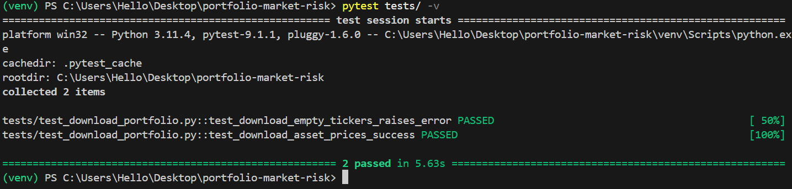
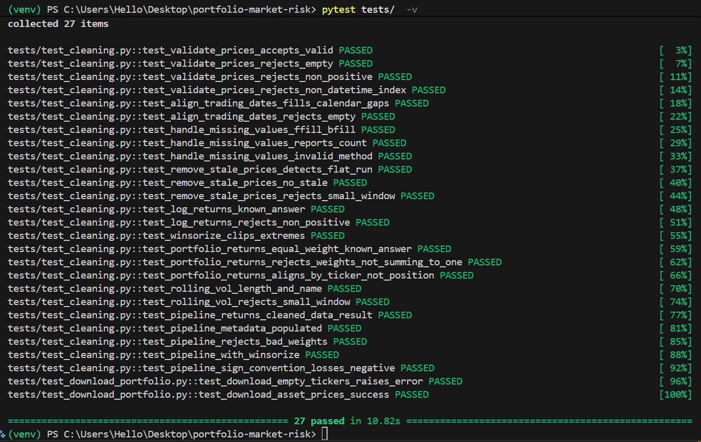

### Portfolio/Equity Market Risk 

## Phase 1: Data Collection


## 1. Project Overview

This repository contains the foundational data pipeline for the Equity Risk Platform. It handles automated data extraction from Yahoo Finance, computes financial return metrics, validates portfolio weights, and stores raw/processed artifacts securely under strict data integrity rules.

---

## 2. Project Directory Structure

```text
project/
├── src/
│   ├── data_collection/
│   │   ├── download_portfolio.py
│   │   ├── returns.py
│   │   └── build_portfolio.py
│   └── data_cleaning/
│       ├── __init__.py
│       └── cleaning.py     
├── data/
│   └── raw/                        
├── tests/                         
├── .github/
│   └── workflows/                  
├── requirements.txt                
└── README.md

```

---

## 3. Installation & Setup

### Prerequisites

Clone the repository and install the approved dependencies:

```bash
pip install -r requirements.txt

```

### Dependencies
see 
```text
requirements.txt
```

---

## 4. Testing & Verification

Run the automated test suite using `pytest` to verify technical correctness and business logic across all modules:

```bash
pytest tests/ -v

```

### Test Results & Verification Screenshot
**Testing Portfolio Download**



**Testing Data Cleaning**



## Phase 2: Data Cleaning

### Overview

Phase 2 cleans Phase 1 adjusted-close prices and builds the risk inputs used downstream:

- Clean price matrix  
- Clean log-return matrix (per asset)  
- Weighted portfolio return series  
- Rolling annualised portfolio volatility  

Steps: date alignment → missing-value handling → stale-price removal → validation → log returns → optional winsorisation → portfolio returns & rolling vol. Each step is logged with `loguru`.

### Module

```text
src/data_cleaning/
├── __init__.py
└── cleaning.py
```

Main entry point: `run_data_cleaning_pipeline(prices, weights)` → `CleanedDataResult`.

Optional diagnostics: `data_overview` / `print_overview` (shape, missingness, describe).

### Usage

```python
from src.data_cleaning import print_overview, run_data_cleaning_pipeline

print_overview(phase1["prices"])
result = run_data_cleaning_pipeline(phase1["prices"], phase1["weights"])

# result.portfolio_returns → VaR / GARCH / backtesting
# result.clean_returns, result.rolling_volatility, result.clean_prices
```

### Conventions

- Returns in **decimal** form (gains +, losses −)  
- Weights must sum to **1.0**  
- Volatility annualised with **√252**  
- No re-download — cleans Phase 1 outputs only  

### Tests

```bash
pytest tests/test_cleaning.py -v
```